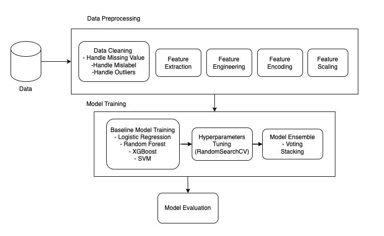

# AIP

## Name:
Chong Koil Jat

## Email:
koiljat@u.nus.edu (e0967840@u.nus.edu)

# Overview

This project is prepared for the National Student AI Challenge 2024, Challenge 1 by AIP. 

# Folder Structure

Please note that this will be the final structure. The models are not present due to their large size. Please run the `run.sh` file to gernerate the models. Depending on your device, running the code for the first time may take awhile to load.

```plaintext
.
├── data
│   ├── breed_labels.csv
│   ├── color_labels.csv
│   ├── pets_pre.csv
│   └── state_labels.csv
├── models
│   ├── Logistic Regression_model.pkl
│   ├── new_lgc_model.pkl
│   ├── new_rfc_model.pkl
│   ├── new_svc_model.pkl
│   ├── new_xgb_model.pkl
│   ├── new_rfc_model.pkl
│   ├── Random Forest_model.pkl
│   ├── stacking_classifier_model.pkl
│   ├── Support Vector Classification_model.pkl
│   ├── voting_classifier_model.pkl
│   └── XGBoost_model.pkl
├── src
│   ├── dataprep
│   │   ├── data_cleaning.py
│   │   ├── data_preprocessing.py
│   │   ├── feature_encoding.py
│   │   ├── feature_engineer.py
│   │   ├── feature_extraction.py
│   │   └── feature_scaling.py
│   ├── modelprep
│   │   ├── hyperparameters_tuning.py
│   │   ├── model_evaluation.py
│   │   └── model_training.py
│   ├── config.py
│   ├── helper.py
│   └── main.py
├── .gitignore
├── eda.ipynb
├── Pipeline.png
├── README.md
├── requirement.txt
└── run.sh
```

Note: The venv folder is omitted. Follow the setup instructions below to prepare your environment.

These instructions will get you a copy of the project up and running on your local machine for development and testing purposes. Follow these steps to set up your project environment.

# Prerequisites

Before you begin, ensure you have met the following requirements:
- Python 3.x
- pip (Python package manager)


These are for reference only. You do not need to install them individually. Please follow the set up below.

- click==8.1.7
- joblib==1.3.2
- langdetect==1.0.9
- nltk==3.8.1
- numpy==1.26.4
- packaging==23.2
- pandas==2.2.1
- plotly==5.19.0
- python-dateutil==2.9.0.post0
- pytz==2024.1
- regex==2023.12.25
- scikit-learn==1.4.1.post1
- scipy==1.12.0
- six==1.16.0
- sklearn==0.0
- tabulate==0.9.0
- tenacity==8.2.3
- textblob==0.18.0.post0
- threadpoolctl==3.3.0
- tqdm==4.66.2
- tzdata==2024.1
- xgboost==2.0.3


## Setup

Follow these steps to set up your development environment:

1. **Create a Virtual Environment**

    Navigate to the project directory:

    ```bash
    cd AIP
    ```

    Then, create a virtual environment named `venv` (or any name you prefer):

    ```bash
    python3 -m venv venv
    ```

2. **Activate the Virtual Environment**

    - On Windows:

      ```cmd
      .\venv\Scripts\activate
      ```

    - On macOS/Linux:

      ```bash
      source venv/bin/activate
      ```

3. **Install Dependencies**

    With the virtual environment activated, install the project dependencies:

    ```bash
    pip install -r requirements.txt
    ```

    This command installs all the necessary Python packages listed in `requirements.txt`.


# Exploratory Data Analysis (EDA) Key Findings

This is a brief summary of the findings and transformation done to the dataset. For a more detailed analysis, you may refer to the `eda.ipynb` file.

## Initial Inspection
Our initial analysis focused on variables like age, quantity, fee, video and photo amounts, and color usage. Key findings include:
- **Age**: A mean of 10.45 years with a high standard deviation, suggesting a wide range in ages. The presence of ages 0 and 255 may indicate errors or outliers.
- **Quantity**: A mean of 1.58, indicating listings often feature more than one pet, though variability is lower compared to age.
- **Fee**: A mean of 21.26 with a high standard deviation and most fees at zero, hinting at a broad range in adoption fees.
- **VideoAmt and PhotoAmt**: Listings predominantly feature photos over videos, with most entries having zero videos.
- **ColorAmt**: Indicates low variability in color usage, with most entries using 1 to 3 colors.

## Data Cleaning and Preprocessing
This phase addressed data integrity and quality through:
- **Missing Values**: Implementing strategies for missing names, breed corrections, and missing descriptions.
- **Outlier Treatment**: Focusing on 'Age' and 'Fee', we capped values at the 95th percentile to reduce skewness.
- **Invalid Values and Duplicates**: Correcting binary values and removing duplicates to ensure data accuracy.
- **Unique Values and Cardinality**: Assessing the impact on encoding and model complexity.

## Univariate Analysis
Analysis of individual variables revealed:
- A considerable number of pets are young and available for adoption at no cost, indicating a preference for adopting younger pets.
- Most pets have photos, highlighting the importance of visual aids in adoption listings.
- The distribution of pet sizes, fur lengths, and health statuses provides insights into the preferences of adopters.

## Bivariate Analysis
Exploring the relationship between adoption and other factors, we found:
- Pets with more photos and videos tend to have higher adoption rates.
- Adoption rates vary with pet attributes such as age, fur length, and health status, suggesting nuanced preferences among adopters.
- Surprisingly, vaccination and sterilization statuses had less impact on adoption rates than expected.

## Multivariate Analysis
Correlation analyses (Pearson, Spearman, Kendall) indicated weak relationships among variables. However, these analyses helped identify patterns and potential predictors for adoption, highlighting the complex interplay of factors influencing adoption decisions.

## Other Statistical Analysis
Further analysis included:
- **Distribution Checks**: Most numerical data were skewed, indicating non-normal distributions.
- **Categorical Analysis**: Examined the impact of variables like breed, color, and gender on adoption rates.

## Feature Engineering
Based on insights, we refined the dataset through:
- Introducing new features that could enhance the predictive model's accuracy for adoption outcomes. Two new variables are added - `DescriptionSentiment` and `DescriptionLangauge`.

## General Suggestions for Pet Adoption
1. **Increased Visual Media**: Enhancing listings with more photos and videos can significantly improve the attractiveness of pets to potential adopters. High-quality visuals provide a better understanding of the pet's appearance and personality, leading to higher engagement and adoption rates.

1. **Individual Listings for Multiple Pets**: Splitting listings with multiple pets into individual listings can increase visibility and adoption opportunities for each pet. This allows potential adopters to focus on one pet at a time, facilitating better connections and increasing the likelihood of adoption.

2. **Optimized Descriptions**: Writing descriptions in languages that are commonly spoken in the community and ensuring they convey positive sentiments can make listings more accessible and appealing to a wider audience. Positive storytelling can evoke emotions and encourage potential adopters to consider adopting a pet.

3. **Fee Waivers**: Offering fee waivers or flexible fee structures can remove financial barriers to adoption, making it more accessible to individuals or families with limited financial resources. This approach promotes inclusivity and ensures that pets find homes based on compatibility rather than financial constraints.

4. **Regional Placement**: Transferring pets to regions with higher adoption rates can increase their visibility and chances of adoption. By strategically relocating pets to areas where there is a higher demand for adoption, shelters can optimize adoption outcomes and find suitable homes for pets more efficiently.

# Model Development and Evaluation

**Problem Statement**

The primary objective of this project is to develop a predictive model that accurately forecasts the likelihood of pets being adopted from their listings. This task is formulated as a binary classification challenge, where the outcome variable, "Adopted," distinguishes between pets that have found a home (1) and those that remain unadopted (0). 

By assigning binary values to the adoption status, the model aims to leverage available data to identify patterns and features that significantly influence adoption outcomes.

## Model Selection Rationale

Given the constraints of a tight project timeline and the limited scope of available data, the decision was made to primarily utilize pre-trained models renowned for their robustness and effectiveness across a variety of datasets. The following models were selected for their unique strengths and their potential to provide a comprehensive overview of different modeling approaches:

1. **Logistic Regression**: Despite exploratory data analysis (EDA) indicating a largely non-linear relationship among variables—owing to the low correlation coefficients observed—Logistic Regression is chosen as the baseline model. Its selection is attributed to the model's simplicity, ease of implementation, and high interpretability, which makes it an ideal starting point for benchmarking performance.

2. **Random Forest and XGBoost**: Both models are recognized for their capability to manage imbalanced datasets and accommodate outliers effectively. Their robust nature stems from leveraging ensemble learning techniques, which aggregate the predictions of numerous decision trees to enhance prediction accuracy and model stability. These characteristics make them particularly suitable for our dataset, expected to exhibit complex patterns and irregularities.

3. **SVM (Support Vector Machine)**: Despite being computationally intensive, which makes it less desirable in scenarios with stringent time or resource constraints, SVM is included in the model lineup for the sake of diversity and comparative analysis. SVM's ability to model non-linear decision boundaries through the kernel trick provides a valuable point of comparison against the other selected models, offering insights into the dataset's underlying structure.

By employing this array of models, the project aims to strike a balance between linear and non-linear approaches, each offering different strengths and insights. This diversified modeling strategy is designed to ensure a thorough exploration of the data's predictive capabilities, ultimately aiming to identify the most effective solution for forecasting pet adoption rates.

## Evaluation Metrics

To comprehensively evaluate the performance of the selected models, our approach extends beyond traditional metrics. While accuracy, recall, precision, and the F1 score remain crucial indicators of model effectiveness, we will also implement k-folds cross-validation to enhance the robustness of our evaluation process. This methodology allows us to leverage the entire dataset for both training and validation purposes, ensuring a thorough assessment of each model's predictive capabilities.

**Data Splitting Strategy**

The dataset will be partitioned into two segments: 80% for training and 20% for testing. This split ensures a substantial amount of data is available for model training while still reserving a significant portion for the final evaluation phase. The 20% will be used for hold-out validation.

**K-Folds Cross-Validation**

K-folds cross-validation will be employed as a pivotal part of our model assessment. By dividing the training data into 'k' subsets, the models will be trained and validated across multiple iterations, where each subset serves as the validation set exactly once. This process not only aids in mitigating the model's potential overfitting to the training data but also provides a more generalized performance indicator across different data samples.

**Final Evaluation**

Upon completing the k-folds cross-validation, the models will undergo a final testing phase using the reserved 20% test data. It is during this stage that we will compute the confusion matrix alongside the established metrics (accuracy, recall, precision, F1 score) for each model. This comprehensive evaluation will enable us to draw meaningful conclusions about each model's performance and determine the most effective approach for predicting pet adoption rates.

## Hyperparameters Tuning

**Hyperparameter Tuning Strategy**

To optimize the performance of our selected models, an efficient approach to hyperparameter tuning is essential. Our strategy involves the utilization of `RandomSearchCV` for this purpose.

**Why RandomSearchCV?**

`RandomSearchCV` offers a pragmatic balance between computational efficiency and the thoroughness of the search across the hyperparameter space. Unlike `GridSearchCV`, which exhaustively tests all possible combinations of hyperparameters, `RandomSearchCV` samples a specified number of parameter settings from the hyperparameter space at random. This approach significantly reduces the computational burden while still providing a good chance of finding a near-optimal set of hyperparameters.

**Consideration of Computational Resources**

Given the constraints on computational resources, `RandomSearchCV` emerges as the preferred method for hyperparameter tuning. It allows for a more flexible exploration of the parameter space without the exhaustive and often computationally expensive process associated with `GridSearchCV`.

By employing `RandomSearchCV`, we aim to efficiently identify effective hyperparameter settings that enhance our models' predictive accuracy and generalizability, thereby improving our ability to forecast pet adoption rates accurately.

## Ensemble Techniques

To further enhance the predictive performance and robustness of our models, we will employ ensemble techniques, specifically focusing on the use of a voting classifier and stacking classifier. These approaches are designed to capitalize on the strengths of individual models while mitigating their weaknesses, thereby reducing bias and the likelihood of overfitting.

**Voting Classifier**

The voting classifier combines multiple different models, leveraging their collective decision-making to improve accuracy. By aggregating the predictions from various models, it aims to achieve a higher level of prediction performance than any single model could on its own. This ensemble method will employ both 'hard' and 'soft' voting mechanisms to determine the most probable outcome for each instance based on majority voting and probability estimates, respectively.

**Stacking Classifier**

Stacking (stacked generalization) involves layering models to use one model's output as input for another, aiming for improved predictive performance. In this approach, a final estimator is trained on the predictions made by base models to make the final prediction. This technique effectively combines the predictive capabilities of multiple models, allowing for a more nuanced and sophisticated analysis that can uncover complex patterns in the data.

By integrating these ensemble techniques into our model evaluation process, we aim to leverage the unique strengths of each individual model, thereby creating a more powerful and reliable predictive tool for assessing pet adoption rates.
# Logical Steps/Flow of the Pipeline

The flow of the pipeline is as followed:

1. Data Preprocessing
   - Data Cleaning
   - Featue Engineering
   - Feature Extraction
   - Feature Encoding
   - Feature Scaling
2. Model Training
3. Model Evaluation



# Instructions for Executing the Pipeline and Modifying Parameters

To execute the entire training pipeline, run the following command from your terminal:

  Navigate to the project directory if you are not already:

   ```bash
   cd AIP
   ```

  Making a .sh File Executable

  ```bash
  chmod +x run.sh
  ```

  Running the .sh File

  ```bash
  ./run.sh
  ```

- If you want to change any parameter in the pipeline, you may head to the respective sections to edit parts of the pipeline.
- If you wish to train with another dataset, head to config.py and change the TRAINING_DATA directory. You may also modify the variables to include in the model there.
- All trained models used in the pipeline are stored in the folder named 'models'.
- Below is an example of how to run the models:

```python3
import pickle
import pandas as pd 

file_path = 'models/stacking_classifier.pkl'  ## Replace this with the other models that you want to use.

# Load the model from the file
with open(file_path, 'rb') as file:
    model = pickle.load(file)

df = pd.read_csv(TRAINING_DATA) ## Replace this with the dateframe to be predicted, TRAINING_DATA shown here as default.

X = process_data(df) ## process_data(df) is from helper.py, it will help you to preprocess your new dataset

predictions = model.predict(X)
``` 


# Model Evaluation 
```plaintext
========================================
Logistic Regression
----------------------------------------
Test score: 0.7499166388796266
Mean cross-validation score: 0.7355348228567574

Classification Report:
              precision    recall  f1-score   support

           0       0.63      0.25      0.36       833
           1       0.77      0.94      0.84      2166

    accuracy                           0.75      2999
   macro avg       0.70      0.60      0.60      2999
weighted avg       0.73      0.75      0.71      2999

╒═════════╤═════════════╤══════════╤════════════╤═══════════╕
│   Class │   Precision │   Recall │   F1-score │   Support │
╞═════════╪═════════════╪══════════╪════════════╪═══════════╡
│       0 │    0.625378 │ 0.248499 │   0.35567  │       833 │
├─────────┼─────────────┼──────────┼────────────┼───────────┤
│       1 │    0.765367 │ 0.942752 │   0.844849 │      2166 │
╘═════════╧═════════════╧══════════╧════════════╧═══════════╛

Confusion Matrix:
╒═════╤══════╕
│ 207 │  626 │
├─────┼──────┤
│ 124 │ 2042 │
╘═════╧══════╛

========================================
Random Forest
----------------------------------------
Test score: 0.7559186395465155
Mean cross-validation score: 0.7458730893223858

Classification Report:
              precision    recall  f1-score   support

           0       0.60      0.36      0.45       833
           1       0.79      0.91      0.84      2166

    accuracy                           0.76      2999
   macro avg       0.69      0.64      0.65      2999
weighted avg       0.74      0.76      0.73      2999

╒═════════╤═════════════╤══════════╤════════════╤═══════════╕
│   Class │   Precision │   Recall │   F1-score │   Support │
╞═════════╪═════════════╪══════════╪════════════╪═══════════╡
│       0 │    0.599606 │ 0.364946 │   0.453731 │       833 │
├─────────┼─────────────┼──────────┼────────────┼───────────┤
│       1 │    0.787721 │ 0.906279 │   0.842851 │      2166 │
╘═════════╧═════════════╧══════════╧════════════╧═══════════╛

Confusion Matrix:
╒═════╤══════╕
│ 304 │  529 │
├─────┼──────┤
│ 203 │ 1963 │
╘═════╧══════╛


========================================
Support Vector Classification
----------------------------------------
Test score: 0.7409136378792931
Mean cross-validation score: 0.7337004819564449

Classification Report:
              precision    recall  f1-score   support

           0       0.72      0.11      0.19       833
           1       0.74      0.98      0.85      2166

    accuracy                           0.74      2999
   macro avg       0.73      0.55      0.52      2999
weighted avg       0.73      0.74      0.66      2999

╒═════════╤═════════════╤══════════╤════════════╤═══════════╕
│   Class │   Precision │   Recall │   F1-score │   Support │
╞═════════╪═════════════╪══════════╪════════════╪═══════════╡
│       0 │    0.715385 │ 0.111645 │   0.193146 │       833 │
├─────────┼─────────────┼──────────┼────────────┼───────────┤
│       1 │    0.74207  │ 0.982918 │   0.84568  │      2166 │
╘═════════╧═════════════╧══════════╧════════════╧═══════════╛

Confusion Matrix:
╒════╤══════╕
│ 93 │  740 │
├────┼──────┤
│ 37 │ 2129 │
╘════╧══════╛

========================================
XGBoost
----------------------------------------
Test score: 0.7709236412137379
Mean cross-validation score: 0.7520426046298829

Classification Report:
              precision    recall  f1-score   support

           0       0.63      0.42      0.51       833
           1       0.80      0.91      0.85      2166

    accuracy                           0.77      2999
   macro avg       0.72      0.66      0.68      2999
weighted avg       0.76      0.77      0.75      2999

╒═════════╤═════════════╤══════════╤════════════╤═══════════╕
│   Class │   Precision │   Recall │   F1-score │   Support │
╞═════════╪═════════════╪══════════╪════════════╪═══════════╡
│       0 │    0.631295 │ 0.421369 │   0.5054   │       833 │
├─────────┼─────────────┼──────────┼────────────┼───────────┤
│       1 │    0.802702 │ 0.905355 │   0.850944 │      2166 │
╘═════════╧═════════════╧══════════╧════════════╧═══════════╛

Confusion Matrix:
╒═════╤══════╕
│ 351 │  482 │
├─────┼──────┤
│ 205 │ 1961 │
╘═════╧══════╛

========================================
new_lgc
----------------------------------------
Test score: 0.7499166388796266
Mean cross-validation score: 0.7355348228567574

Classification Report:
              precision    recall  f1-score   support

           0       0.63      0.25      0.36       833
           1       0.77      0.94      0.84      2166

    accuracy                           0.75      2999
   macro avg       0.70      0.60      0.60      2999
weighted avg       0.73      0.75      0.71      2999

╒═════════╤═════════════╤══════════╤════════════╤═══════════╕
│   Class │   Precision │   Recall │   F1-score │   Support │
╞═════════╪═════════════╪══════════╪════════════╪═══════════╡
│       0 │    0.625378 │ 0.248499 │   0.35567  │       833 │
├─────────┼─────────────┼──────────┼────────────┼───────────┤
│       1 │    0.765367 │ 0.942752 │   0.844849 │      2166 │
╘═════════╧═════════════╧══════════╧════════════╧═══════════╛

Confusion Matrix:
╒═════╤══════╕
│ 207 │  626 │
├─────┼──────┤
│ 124 │ 2042 │
╘═════╧══════╛

========================================
new_rfc
----------------------------------------
Test score: 0.7565855285095031
Mean cross-validation score: 0.7452890608785075

Classification Report:
              precision    recall  f1-score   support

           0       0.61      0.35      0.44       833
           1       0.79      0.91      0.84      2166

    accuracy                           0.76      2999
   macro avg       0.70      0.63      0.64      2999
weighted avg       0.74      0.76      0.73      2999

╒═════════╤═════════════╤══════════╤════════════╤═══════════╕
│   Class │   Precision │   Recall │   F1-score │   Support │
╞═════════╪═════════════╪══════════╪════════════╪═══════════╡
│       0 │    0.607069 │ 0.35054  │   0.444444 │       833 │
├─────────┼─────────────┼──────────┼────────────┼───────────┤
│       1 │    0.785147 │ 0.912742 │   0.84415  │      2166 │
╘═════════╧═════════════╧══════════╧════════════╧═══════════╛

Confusion Matrix:
╒═════╤══════╕
│ 292 │  541 │
├─────┼──────┤
│ 189 │ 1977 │
╘═════╧══════╛

========================================
new_xgb
----------------------------------------
Test score: 0.7639213071023675
Mean cross-validation score: 0.756878335113915

Classification Report:
              precision    recall  f1-score   support

           0       0.65      0.33      0.44       833
           1       0.78      0.93      0.85      2166

    accuracy                           0.76      2999
   macro avg       0.72      0.63      0.64      2999
weighted avg       0.75      0.76      0.74      2999

╒═════════╤═════════════╤══════════╤════════════╤═══════════╕
│   Class │   Precision │   Recall │   F1-score │   Support │
╞═════════╪═════════════╪══════════╪════════════╪═══════════╡
│       0 │    0.647059 │ 0.330132 │   0.437202 │       833 │
├─────────┼─────────────┼──────────┼────────────┼───────────┤
│       1 │    0.783217 │ 0.930748 │   0.850633 │      2166 │
╘═════════╧═════════════╧══════════╧════════════╧═══════════╛

Confusion Matrix:
╒═════╤══════╕
│ 275 │  558 │
├─────┼──────┤
│ 150 │ 2016 │
╘═════╧══════╛

========================================
new_svc
----------------------------------------
Test score: 0.7539179726575526
Mean cross-validation score: 0.7421211089830659

Classification Report:
              precision    recall  f1-score   support

           0       0.65      0.24      0.35       833
           1       0.77      0.95      0.85      2166

    accuracy                           0.75      2999
   macro avg       0.71      0.60      0.60      2999
weighted avg       0.73      0.75      0.71      2999

╒═════════╤═════════════╤══════════╤════════════╤═══════════╕
│   Class │   Precision │   Recall │   F1-score │   Support │
╞═════════╪═════════════╪══════════╪════════════╪═══════════╡
│       0 │    0.653722 │ 0.242497 │   0.353765 │       833 │
├─────────┼─────────────┼──────────┼────────────┼───────────┤
│       1 │    0.765428 │ 0.9506   │   0.848023 │      2166 │
╘═════════╧═════════════╧══════════╧════════════╧═══════════╛

Confusion Matrix:
╒═════╤══════╕
│ 202 │  631 │
├─────┼──────┤
│ 107 │ 2059 │
╘═════╧══════╛


========================================
voting_classifier
----------------------------------------
Test score: 0.7619206402134044
Mean cross-validation score: 0.7527925696034733

Classification Report:
              precision    recall  f1-score   support

           0       0.64      0.32      0.43       833
           1       0.78      0.93      0.85      2166

    accuracy                           0.76      2999
   macro avg       0.71      0.63      0.64      2999
weighted avg       0.74      0.76      0.73      2999

╒═════════╤═════════════╤══════════╤════════════╤═══════════╕
│   Class │   Precision │   Recall │   F1-score │   Support │
╞═════════╪═════════════╪══════════╪════════════╪═══════════╡
│       0 │    0.643373 │ 0.320528 │   0.427885 │       833 │
├─────────┼─────────────┼──────────┼────────────┼───────────┤
│       1 │    0.78096  │ 0.931671 │   0.849684 │      2166 │
╘═════════╧═════════════╧══════════╧════════════╧═══════════╛

Confusion Matrix:
╒═════╤══════╕
│ 267 │  566 │
├─────┼──────┤
│ 148 │ 2018 │
╘═════╧══════╛

========================================
stacking_classifier
----------------------------------------
Test score: 0.7672557519173058
Mean cross-validation score: 0.7594627800504867

Classification Report:
              precision    recall  f1-score   support

           0       0.65      0.34      0.45       833
           1       0.79      0.93      0.85      2166

    accuracy                           0.77      2999
   macro avg       0.72      0.64      0.65      2999
weighted avg       0.75      0.77      0.74      2999

╒═════════╤═════════════╤══════════╤════════════╤═══════════╕
│   Class │   Precision │   Recall │   F1-score │   Support │
╞═════════╪═════════════╪══════════╪════════════╪═══════════╡
│       0 │    0.653759 │ 0.344538 │   0.451258 │       833 │
├─────────┼─────────────┼──────────┼────────────┼───────────┤
│       1 │    0.786719 │ 0.929825 │   0.852306 │      2166 │
╘═════════╧═════════════╧══════════╧════════════╧═══════════╛

Confusion Matrix:
╒═════╤══════╕
│ 287 │  546 │
├─────┼──────┤
│ 152 │ 2014 │
╘═════╧══════╛
```

### 1. Model Evaluation

```plaintext
| Model                      | Test Score | Cross-Validation Score | Precision (Class 0) | Recall (Class 0) | F1-score (Class 0) | Precision (Class 1) | Recall (Class 1) | F1-score (Class 1) | Class Imbalance Handling |
|----------------------------|------------|------------------------|---------------------|------------------|--------------------|---------------------|------------------|--------------------|--------------------------|
| Logistic Regression        | 0.7499     | 0.7355                 | 0.63                | 0.25             | 0.36               | 0.77                | 0.94             | 0.84               | Poor                     |
| Random Forest              | 0.7559     | 0.7459                 | 0.60                | 0.36             | 0.45               | 0.79                | 0.91             | 0.84               | Good                     |
| Support Vector Machine     | 0.7409     | 0.7337                 | 0.72                | 0.11             | 0.19               | 0.74                | 0.98             | 0.85               | Poor                     |
| XGBoost                    | 0.7709     | 0.7520                 | 0.63                | 0.42             | 0.51               | 0.80                | 0.91             | 0.85               | Good                     |
| New Logistic Regression    | 0.7499     | 0.7355                 | 0.63                | 0.25             | 0.36               | 0.77                | 0.94             | 0.84               | Poor                     |
| New Random Forest          | 0.7566     | 0.7453                 | 0.61                | 0.35             | 0.44               | 0.79                | 0.91             | 0.84               | Good                     |
| New XGBoost                | 0.7639     | 0.7569                 | 0.65                | 0.33             | 0.44               | 0.78                | 0.93             | 0.85               | Good                     |
| New Support Vector Machine | 0.7539     | 0.7421                 | 0.65                | 0.24             | 0.35               | 0.77                | 0.95             | 0.85               | Poor                     |
| Voting Classifier          | 0.7619     | 0.7528                 | 0.64                | 0.32             | 0.43               | 0.78                | 0.93             | 0.85               | Good                     |
| Stacking Classifier        | 0.7673     | 0.7595                 | 0.65                | 0.34             | 0.45               | 0.79                | 0.93             | 0.85               | Good                     |
```

### 2. Comparative Analysis

1. **Model Complexity**:
   - Logistic Regression and SVC: Simpler linear models.
   - Random Forest and XGBoost: Tree-based models, handling complex relationships.
   - Ensemble Methods (Voting and Stacking Classifiers): Complex models combining multiple algorithms.

2. **Interpretability**:
   - Logistic Regression and SVC: More interpretable due to linearity.
   - Random Forest and XGBoost: Less interpretable, but offer insights into feature importance.
   - Ensemble Methods: Less interpretable due to aggregation of predictions.

3. **Training Time**:
   - Logistic Regression and SVC: Faster training times compared to tree-based models.
   - Random Forest and XGBoost: Longer training times, especially on large datasets.
   - Ensemble Methods: Longer training times due to training multiple models.

4. **Robustness to Noise and Outliers**:
   - Random Forest and XGBoost: More robust due to non-linear nature.
   - Logistic Regression and SVC: May struggle with noise and outliers, especially when assumptions are violated.

5. **Scalability**:
   - Logistic Regression and SVC: More scalable to large datasets.
   - Random Forest and XGBoost: May suffer from scalability issues with extremely large datasets.
   - Ensemble Methods: Scalability depends on underlying models.

6. **Handling Imbalanced Classes**:
   - Random Forest, XGBoost, and Ensemble Methods: Better handling compared to Logistic Regression and SVC.

7. **Overall Performance**:
   - Stacking Classifier: Emerges as the top performer, with highest test score and cross-validation score.
   - XGBoost and Voting Classifier: Demonstrated strong performance and balance between performance and interpretability.
   - Logistic Regression and SVC: Lower performance, particularly in handling class imbalance and capturing complex relationships.


# Other considerations

Ethical considerations are paramount in this project, particularly regarding discrimination based on breed, color, or gender. Therefore, mitigating overfitting of the data is crucial. Robust models adept at handling unbalanced data and outliers have been employed to address this concern. Furthermore, the utilization of a diverse array of models helps mitigate any potential biases.

Another factor to consider is the computational resources utilized in this project, which are minimized wherever possible. For scalability, cloud services like AWS SageMaker can be utilized for training the model in the cloud, though it's important to note that this incurs additional costs.